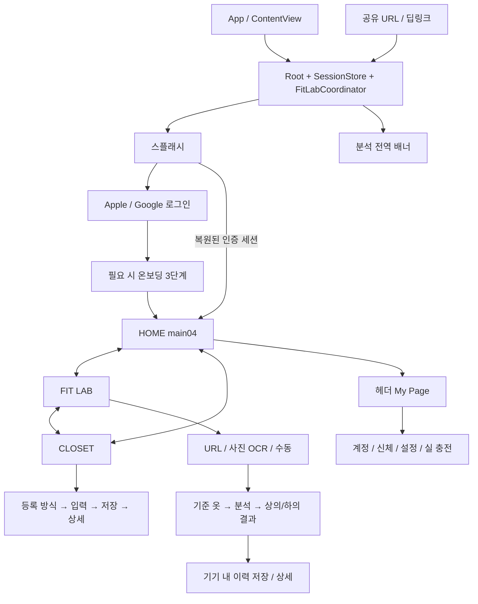

# Coordit SwiftUI → Android 포팅 감사

조사일: 2026-09-16. 기준 SHA: `bd1f9311638645a4a1500c2a5693a33482dc1214`.

이 문서는 첨부 요청의 **첫 번째 작업 / Phase 1** 결과다. 기존 코드는 수정하지 않았다. 아래 Android 구조와 대응은 구현 계획이며, 동작하거나 시각 검증을 통과한 Android 기능으로 해석하면 안 된다. 소스에서 확인한 사실과 플랫폼 대응 제안을 구분한다.

## GitHub 비교와 기준 선택

| 항목 | 확인 결과 |
|---|---|
| 원래 작업 트리 | `coordit-dev`, `main`, HEAD `9d348bc7a3d7e962a98713c1c34161e84632a5c1` |
| fetch 후 비교 | `git rev-list --left-right --count HEAD...origin/main` = `0 29` |
| 원격 최신 | `bd1f931`, `fix(ios): resolve App Review authentication rejection` |
| 변경 규모 | 120개 파일, 추가 15,233줄 / 삭제 435줄 |
| 기존 미커밋 내용 | fit-report 관련 6개 파일, docs 3개 파일; `.coordit-report-work/`, `deliverables/` 미추적 |
| 새 브랜치 | `codex/android-native-port`, 최신 `origin/main`에서 생성 |
| 작업 위치 | `/Users/insihwan/Documents/Project/coordit/coordit-android/android` |

기존 미커밋 수정과 원격 수정이 fit-report service에서 겹친다. 이를 포팅 작업에 임의 병합하지 않고 원래 작업 트리를 그대로 보존했다. 원래 `coordit-dev`는 계속 `main`이다. 최신 코드 감사는 새 작업 트리에서 수행했다.

반드시 가져가야 하는 원격 변경은 인증 성공 즉시 인증 화면 닫기(`bd1f931`), Keychain 세션 갱신·refresh·온보딩 캐시·신규 지갑 seed(`2358bb0`), FitLab 결과 전달 안정화(`482c157`), 보고서 영속화(`caa0ee6`), 광고 SSV 및 Apple 결제 정산이다. 이전 로컬 iOS 소스를 그대로 포팅하면 이 수정이 누락된다.

## A. 현재 iOS 아키텍처

진입점은 [coorditApp.swift](../../coordit/coordit/coorditApp.swift) → [ContentView.swift](../../coordit/coordit/ContentView.swift) → [CoorditRootView.swift](../../coordit/coordit/CoorditRootView.swift)다. SwiftUI 앱과 Share Extension, UI-test target으로 구성된다. Xcode 설정상 iOS deployment target은 26.5다.

앱·확장 Swift 파일 71개, UI-test Swift 파일 12개를 조사했다. 전체 선언 및 위치는 [인벤토리](IOS_SOURCE_INVENTORY.md)와 [JSON](ios-source-inventory.json)에 있다.

- `CoorditBackendSessionStore`: 앱에서 만든 `@StateObject`, `EnvironmentObject`로 공유. 인증·프로필·온보딩·옷장·기준 옷·지갑과 연결된다.
- `CoorditRootView`: 단일 route, 옷장 목록/선택/등록 draft, 참조 옷 선택, 지갑 잔액, 온보딩·인증 표시, 공유 URL을 소유한다.
- `CoorditFitLabCoordinator`: root 소유 `@StateObject`. 분석 단계·실패/재시도·결과·저장 이력·전역 진행 알림을 관리한다. 탭 전환으로 분석을 취소하면 안 된다.
- 지역 `@State`와 binding이 URL/OCR/수동 입력과 폼을 관리한다. 광고/결제에는 별도 ObservableObject가 있다. Kotlin에서는 화면 ViewModel과 앱/flow 범위 상태를 구분한다.
- 네트워크는 `CoorditBackendClient`와 `CoorditFitLabAPIClient`의 URLSession/async-await. 서버가 fit 계산 및 보고서를 담당한다.
- 저장소는 Keychain, UserDefaults, 사용자별 JSON 이력이다. 옷장 사진은 현재 메모리 데이터이며 영구 이미지 저장 계약은 확인되지 않았다. CoreData/SwiftData/Room에 대응할 기존 DB는 없다.
- 메인 navigation은 `NavigationStack`이 아니라 route enum switch + `.id(route)`다. 화면이 바뀌면 지역 상태가 다시 만들어지는 점을 단순한 영구 ViewModel로 바꾸지 않는다.



그림은 실제 화면 관계 요약이다. 미인증 공유 URL도 인증 gate를 통과해야 하고, 온보딩 미완료 사용자는 제품 진입이 제한된다. Android Back은 dialog → 내부 입력 단계 → 명시적 부모 route → 루트 이탈 순서를 구현하고, 탭/로그아웃/프로세스 복원에 대해 검증한다.

## B. 전체 화면 목록

[CoorditFrameRoute.swift](../../coordit/coordit/CoorditFrameRoute.swift)에 32개 route가 있다. route 수와 고유 화면 수는 다르며, 인증·온보딩·crop·sheet는 enum 밖의 화면이다.

| Route / 화면 | 실제 동작·추가 상태 | 원본 |
|---|---|---|
| `splash` | 신규 로그인 CTA / 복원 사용자 탭 진입; tagline·divider·logo 단계 애니메이션 | CoorditSplashScreen.swift |
| 인증 진입 | Apple/Google, 처리 중, 실패; 파일명 Sheet와 달리 전체 화면 구성 | CoorditSplashAuthenticationSheet.swift |
| 온보딩 | 프로필 → 선택 신체 정보 → 필수/선택 약관; validation, 법적 문서 sheet | CoorditOnboardingView.swift |
| `main01` | 예전 홈 chrome; DEBUG 직접 진입 가능, 일반 홈이 아님 | Main01Screen.swift |
| `main04` | 실제 홈; 매거진 pager/4초 자동 전환, 이력, 기준 옷, 경고/빈 상태 | CoorditHomeScreens.swift |
| 기준 옷 선택 sheet | 상의/하의 그룹, 복수 선택, 취소/확인, 신규 등록 연결 | CoorditHomeReferenceSelection.swift |
| `fitlab-input` | 방식 선택; URL·사진·수동 입력/검토/확정; 잔액·기준 옷 상태 | CoorditFitLabScreens.swift + 각 Input.swift |
| `fitlab-loading` | 단계별 분석 진행·실패·재시도; 다른 탭에서도 분석 유지 | CoorditFitLabScreens.swift |
| `fitlab-result-top`, `fitlab-result-bottom` | 점수·실루엣·사이즈별 비교·리포트; 보고서 누락/재시도; 저장/이미 저장/이탈 확인 | CoorditFitLabScreens.swift |
| `fitlab-history-register` | production에서는 historyDetail 구성; 별도 legacy 화면은 fixture 전용 | CoorditFitLabScreens.swift |
| `fitlab-history-detail` | 저장된 snapshot 상세; 선택 이력 없음 처리 | CoorditFitLabHistoryDetailScreen.swift |
| `closet-overview` | 상·하의/세부 카테고리 필터, 검색, 그리드, 기준 치수, 빈 상태 | CoorditClosetScreens.swift |
| `closet-detail-top`, `closet-detail-bottom` | 사진·치수·기준 비교; 이름 변경, 사진 교체, 삭제 확인 | CoorditClosetDetailScreen.swift |
| `closet-add-method` | URL / 사이즈표 사진 / 수동 선택 | CoorditClosetAddFlow.swift |
| `closet-add-link` | URL 추출·사이즈 선택·편집·의류 사진·저장 readiness | CoorditClosetAddFlow.swift |
| `closet-add-photo` | 카메라/라이브러리·crop·OCR·편집·사이즈 선택·실패 복구 | CoorditClosetAddFlow.swift |
| `closet-add-manual` | 분류·기본 정보·선택 사진·필수 치수·validation | CoorditClosetAddFlow.swift |
| `closet-add-loading` | 서버 저장·실패·재시도 | CoorditClosetAddFlow.swift |
| `closet-add-result` | 실제 옷 상세 재사용; FitLab에서 시작한 등록은 FitLab으로 복귀 | CoorditClosetScreens.swift |
| `mypage` | 잔액, 실 충전, 계정·신체·알림·개인정보·앱 설정 | CoorditMyPageScreens.swift |
| `mypage-thread-charge` | 잔액, 보상광고, 결제 상품; readiness/retry/pending/실 부족 popup | CoorditThreadChargeScreen.swift |
| `mypage-account` | 연결 계정, 프로필, 탈퇴, 실제 로그인/로그아웃 controls | CoorditMyPageScreens.swift |
| `mypage-profile-edit` | 이름·소개·아바타; 서버 저장은 displayName만 | CoorditMyPageAccountDestinationScreens.swift |
| `mypage-password-change` | 소셜 계정 안내. 비밀번호 입력 폼이 아님 | CoorditMyPageAccountDestinationScreens.swift |
| `mypage-logout` | 확인 후 세션 제거·스플래시 복귀 | CoorditMyPageAccountDestinationScreens.swift |
| `mypage-account-deletion` | 경고·확인 checkbox·disabled CTA·삭제/실패 상태 | CoorditMyPageAccountDestinationScreens.swift |
| `mypage-body`, `mypage-body-measurements` | 저장 신체 정보·키/몸무게 수정·실패/성공 | CoorditMyPageSupportDestinationScreens.swift |
| `mypage-privacy` | 약관·개인정보 링크·필수 동의·로컬 토글 | CoorditMyPagePreferencesScreens.swift |
| `mypage-app-settings` | 앱 버전, 메일 문의 | CoorditMyPagePreferencesScreens.swift |
| `mypage-notifications` | 마케팅 토글·OS 권한 상태·설정 이동 | CoorditMyPagePreferencesScreens.swift |
| `mypage-privacy-policy`, `mypage-terms` | 문서 스크롤 | CoorditMyPageSupportDestinationScreens.swift |
| 사이즈표 crop | 전체 화면, 영역 이동·4 corner resize; 취소/적용 | CoorditSizeChartCropper.swift |

추가 presentation: root/홈 기준 옷 sheet, 온보딩 fullScreenCover와 약관 sheet, PhotosPicker/카메라 sheet, crop fullScreenCover, 옷 이름 alert/삭제 confirmationDialog, 수동 분류 변경 시 데이터 폐기 확인, 새 분석 시작 확인, 실 부족 커스텀 dim popup. `CoorditGlobalFitAnalysisBanner`는 분석 중/완료/실패·탭 이동·위로 밀어 닫기를 가지며 표시 중 헤더를 숨긴다.

URL/OCR 입력은 선택 → 처리 → 편집 검토 → 확정 단계가 있다. OCR 취소 시 기존 draft 보존, 입력 분류 변경 시 치수 폐기 확인, 사이즈 행 추가·삭제, 기준 옷 없음/갱신 race, 키보드 Done 동작도 화면 완료 기준에 포함한다.

## C. 전체 Widget 목록

**이 기준 커밋에는 WidgetKit 위젯 0개.** `WidgetKit`, `WidgetBundle`, `TimelineProvider`, `WidgetConfiguration`, `com.apple.widgetkit` 검색과 Xcode target을 함께 확인했다. 실제 확장은 [ShareViewController.swift](../../coordit/CoorditShareExtension/ShareViewController.swift)의 Share Extension이다.

따라서 widget 크기·timeline·snapshot·placeholder·widget deep link 원본은 없다. 원본이 없는 위젯을 Android 스타일로 창작하지 않는다. 다른 저장소/미병합 브랜치에 위젯이 있다면 별도 기준 소스로 추가 감사해야 하며, 이 보고서는 존재하지 않는다고 전체 조직까지 일반화하지 않는다.

## D. Reusable UI component 목록

| 범주 | 원본 컴포넌트/파일 | Compose 대응 |
|---|---|---|
| Chrome | CoorditScreenScaffold, SharedAppBackground, ScreenChrome, Main01Header/ChromeBackground | edge-to-edge Box, 고정 overlay, 다중 stop Brush, scroll mask |
| 하단 탭 | CoorditLiquidGlassBottomNavigation, Main01Tab | 자체 capsule/선택 pill/아이콘·폰트, 세 탭만 |
| 제목/뒤로 | CoorditBackTitleCard, FeatureTitleBar | 자체 Row/card와 버튼 hit area |
| CTA/press | CoorditContentActionButtonStyle, CoorditPressFeedbackButtonStyle | Foundation interaction + scale/alpha/overlay |
| 설정 UI | CoorditSettingsComponents, MyPageDestinationComponents | card/row/divider/value pill/toggle/field/segment 재사용 |
| 옷장 | ClosetSegment, MeasurementTile, GarmentCard, 이미지/placeholder | reusable garment card와 폼 |
| FitLab | SourceButton, textured panel, mannequin mask/connector, legend, report card | Canvas + 실제 텍스트/클릭 가능한 컴포넌트 |
| 점수/비교 | ScoreCard, MeasurementRows, SizeChart, YarnTrail, DifferenceChart | 선택 StateFlow를 공유하는 Canvas/레이아웃 |
| 로딩 | CoorditOrbitLoadingIndicator | 원본 회전/궤도 타이밍 및 reduce motion 대응 |
| 기준 옷 | HomeReferenceSummary/SelectionSheet | 같은 item/selection 모델 공유 |

개별 private View와 nested enum까지 포함한 전체 목록은 [IOS_SOURCE_INVENTORY.md](IOS_SOURCE_INVENTORY.md)에 있다. fixture 및 미사용 `CoorditMainShell`을 production 컴포넌트로 착각하지 않는다.

API·DTO·ViewModel·저장소의 상세 목록과 재시도/인증 계약은 [데이터 계약 감사](DATA_CONTRACT_AUDIT.md)를 참조한다.

## E. Android에서 그대로 재사용 가능한 로직

서버의 fit scoring·reference profile·추천·report 생성·Supabase persistence 및 기존 플랫폼 독립 API 계약을 그대로 사용한다. Swift 소스를 Kotlin에서 그대로 실행한다는 뜻은 아니다.

Kotlin으로 의미를 보존하여 옮길 부분: garment/category 및 measurement key, 요청 순서, validation/size-label normalization, 선택 기준 옷 규칙, 표시 숫자·부호·타이트/비슷/여유 의미, URL 검증·공유 queue 중복 제거, 결과 snapshot, 사이즈별 비교 fallback.

특히 `shoulder_width`, `chest_width`, `total_length`, `sleeve_length`, `waist_width`, `hip_width`, `rise`, `outseam`은 단면 cm 값이다. 신체 둘레 값으로 바꾸거나 앱에서 별도 추천 알고리즘을 만들지 않는다.

공유할 자산: 이미지 세트 26개(브랜드/탭/상·하의 실루엣·마스크·로딩·마이페이지·스플래시), 별도 appicon set, 폰트 5개. 25개의 SVG 중 filter가 있는 자산은 단순 VectorDrawable 변환 전후 blur/shadow 확인이 필요하다. 자산 사용 권리/Android 재배포 가능 범위는 저장소에 별도 라이선스 근거가 충분한지 출시 전에 확인한다.

## F. Android에서 재구현해야 하는 부분

SwiftUI 전체 view tree/modifier, ViewModel 상태 소유권, Navigation Compose와 Back, keyboard/focus, lifecycle/process death, Keychain 대체 저장소, 사진/camera/crop/OCR, share receiver/deep link, Google/Apple 로그인 SDK 접점, 광고·결제 SDK, 알림 권한, Liquid Glass 표현이 대상이다.

핏 실루엣은 3D 모델이 아니다. 원본 이미지와 치수별 의미 마스크·연결선·anchor로 구현되어 있다. Canvas/자산 위에 실제 상태를 얹어야 하며 화면 전체를 screenshot으로 대체하지 않는다. 사이즈를 누르면 점수·실루엣·차트가 함께 바뀌어야 한다.

## G. Apple 전용 기능 및 Android 대응 방식

| iOS 원본 | Android 대응 계획 | 계약/검증 조건 |
|---|---|---|
| Keychain(Security) | Android Keystore 키로 세션 암호화; private file 저장 | 토큰을 일반 DataStore에 평문 저장하지 않음; atomic 갱신/삭제 |
| UserDefaults | Preferences DataStore | 사용자별 온보딩 캐시·welcome·마케팅 설정 구분 |
| PhotosUI / UIImagePickerController | Photo Picker / camera intent 또는 CameraX | 라이브러리·카메라 취소/권한·orientation·crop 보존 |
| Vision OCR | Android OCR adapter(한국어 지원 엔진 검토) + 기존 표 해석 로직 | 실제 사이즈표 corpus로 좌표·행/열·숫자·단위 비교 |
| App Group + Share Extension | ACTION_SEND text/plain 및 ACTION_VIEW 수신·영속 대기 queue | cold/warm start, URL 중복, 미인증 pending URL 보존 |
| AuthenticationServices Apple | Custom Tabs/web authorization + 안전한 callback/session 교환 | Services ID·return URL·서버 설정 필요; 버튼만 흉내내지 않음 |
| GoogleSignIn | Credential Manager Google 인증 adapter | Android 앱 서명/package 및 서버 client ID·nonce 계약 확인 |
| StoreKit | Google Play Billing | 현재 서버는 Apple transaction 검증 전용; 별도 Play 검증/정산 계약 필요 |
| GoogleMobileAds | Android Google Mobile Ads rewarded SDK | Android app/ad unit, SSV custom data, 실제 서버 보상 완료 확인 |
| UserNotifications | OS 알림 권한·상태 및 설정 이동 | 현 소스에 APNs device-token 등록/실제 원격푸시 전송 구현은 확인 안 됨 |
| UIKit/CoreText | Compose Canvas/text/font·image 처리 | baseline·font axis·그림자·blur 실 렌더링 비교 |
| SwiftUI Liquid Glass | blur/translucent layer·stroke·tint·shadow 기반 커스텀 capsule | 동일한 Apple 렌더러는 사용 불가; 정적/pressed/selected 배경별 비교 |

CloudKit, HealthKit, MapKit, CoreLocation, BackgroundTasks, WidgetKit 사용은 현재 앱 소스에서 확인되지 않았다. 해당 Android 기능을 추측해 추가하지 않는다.

공식 플랫폼 근거: [Apple 다른 플랫폼 로그인](https://developer.apple.com/documentation/signinwithapple/incorporating-sign-in-with-apple-into-other-platforms), [Services ID 설정](https://developer.apple.com/help/account/capabilities/configure-sign-in-with-apple-for-the-web), [Play Billing 서버 연동](https://developer.android.com/google/play/billing/backend). 로그인/Play 설정은 구현 검증 전 확인해야 할 의존성이지 현재 설정 완료를 뜻하지 않는다.

### 플랫폼 차이 기록

**iOS 원본:** Liquid Glass 하단 탭.

**Android 제약:** Apple의 GlassEffectContainer 렌더러를 Compose에서 그대로 실행할 수 없다.

**선택한 구현(계획):** 원본 capsule 비율·tint·outline·shadow·선택 pill을 유지하고 렌더링 계층에서 blur 근사.

**UI 차이:** 굴절/배경 샘플링은 기기별 차이가 예상되며 screenshot 검증 전 동일성 판정 불가.

**기능 차이:** 탭 선택·pressed·접근성·선택 상태는 동일하게 보존할 계획.

**iOS 원본:** StoreKit 소모성 실 충전.

**Android 제약:** Apple signed transaction을 Play purchase token으로 대체 전송할 수 없다.

**선택한 구현(계획):** Play Billing 상품 조회/구매 + 서버 검증·중복 방지·consume/acknowledge 흐름. 기존 Apple endpoint 의미는 변경하지 않음.

**UI 차이:** OS 구매 sheet·현지화 가격은 Play 제공값 사용. 앱 내부 충전 카드 구성은 유지.

**기능 차이:** Play 서버 계약·상품 설정이 생기기 전 실제 Android 유료 충전은 미구현/출시 차단 항목이다.

**iOS 원본:** Apple/Google SDK 로그인, 사진 picker·카메라·OS 권한 sheet.

**Android 제약:** 플랫폼 소유 화면의 외형을 앱이 픽셀 단위 제어할 수 없음.

**선택한 구현(계획):** 앱 내부 entry/crop/form은 원본 재현, OS 인증/선택 화면은 플랫폼 adapter 사용.

**UI 차이:** 시스템 화면에 한해 공급자/OS 차이 존재.

**기능 차이:** callback 취소·오류·재시도·원래 draft 복귀까지 동등하게 검증.

## H. SwiftUI → Compose UI 매핑 계획

| SwiftUI | Compose | 주의점 |
|---|---|---|
| VStack/HStack/ZStack | Column/Row/Box | 정렬·zIndex·overlay 순서를 원본대로 |
| frame/padding/offset | size/requiredSize/padding/offset/graphicsLayer | modifier 적용 순서에 따라 hit area와 clip이 달라짐 |
| Color/gradient/stroke/shadow | AppColors/Brush/border/custom shadow | Main01 다중 gradient stops·contour mask 유지 |
| custom Font | res/font + TextStyle + variation settings | Gmarket 실제 weight 및 baseline, 폰트 fallback 검증 |
| @State/@Binding | rememberSaveable + state/callback | 지역 UI 수명과 shared draft 구분 |
| ObservableObject/@Published | ViewModel + StateFlow | app/root와 화면 scope 구분; 탭 이동 중 분석 유지 |
| EnvironmentObject | 앱 container + shared ViewModel | 과도한 DI/계층 분리 없이 동일 소유권 |
| route switch + transition | Navigation Compose + 원본 전환 | route parent/입력 단계별 Back; 이중 navigation 방지 |
| sheet/fullScreenCover | 원본 크기·배경의 Dialog/별도 destination | 기본 Material sheet 외형으로 자동 치환 금지 |
| Button/TextField | BasicText/BasicTextField/Foundation clickable 기반 | 기본 최소 높이·inset·underline·ripple 유입 금지 |
| onChange/task/scenePhase | lifecycle-aware collection/LaunchedEffect | 재진입 중복 요청·로그아웃 stale response 차단 |
| ScrollView/GeometryReader | scrolling layout + measured constraints | width/402, 고정 chrome, keyboard/safe area 조건 보존 |
| gesture/animation | pointer input/animate/tween | crop drag, banner swipe, pressed와 reduce motion 보존 |

### 추출한 디자인 기준

| 항목 | 원본 값 |
|---|---|
| 화면 배율 | `max(width / 402, 0.1)`; 임의 상한 없음 |
| 기본 | pageInset22, panelPadding20, cornerRadius10 |
| Chrome | header top59, width333, height38.8117, icon30, logo139; 상단200/하단155 |
| 하단 nav | 영역92, glass66, 가로16, bottom10, padding6, gap8, tab minHeight50 |
| Glass | parent navy tint .42, selected white .18, white stroke .28/0.8, navy shadow .28/r12/y6 |
| Back title | 372×60, radius6, 가로 padding26, arrow23, Climate2019 22, tracking1.2 |
| Home | reference/card361, magazine height259 |
| MyPage/충전 | width370/354; width≤380 & height≤700인 경우 내용에 .78 compact 배율 |
| 버튼 | pressed scale .965 / opacity .88 / black overlay .16 / 35ms; disabled .38 |
| 전환 | source ±18/100ms, target ±22/140ms delay100ms; reduce motion 0 offset/60·80ms |

`Spacing.navHeight=86`과 `Main01.Metrics.navHeight=92`는 서로 다른 선언이다. 숫자를 통합하기 전에 실제 사용처를 따라야 한다. Reference sheet/crop/banner/일부 onboarding은 고정 pt를 쓰므로 모든 치수에 일괄 배율을 곱하지 않는다.

색상: background `#F7F8F8`, ink `#000C40`, muted `#7E8492`, purchaseStatus `#454E74`, fitMuted `#7F8596`, panel `#FCFDFE`, field `#F5F7FC`, settingsField `#F6F7F9`, closetField `#F2F4F8`, closetMuted `#B8C1D3`, placeholder `#E7EBF4`, line `#E1E5EA`, blue `#194096`, cyan `#00ACCF`, green `#00B443`, red `#EB2549`, danger `#EA4A56`, warmLine `#FFBC38`, loadingSparkle `#F6D77A`. 충전 gradient `#324274 → #000C40 → #4A5584`.

폰트: GmarketSans Light/Medium/Bold, Mona12TextHK, ClimateCrisisKR variable. nav HOME 10.8/tracking .24, FIT LAB 11.5/−.8, CLOSET 12/−.8. 크기뿐 아니라 tracking/kerning, lineSpacing, alignment, 색, 상대 textStyle에 따른 Dynamic Type를 보존한다. 전체 호출 위치는 JSON `typography` 배열을 참조한다. font 상속·주변 foreground·lineLimit는 각 호출의 View 문맥에서 해석해야 한다.

**폰트 바이너리 확인:** ClimateCrisis `YEAR` 축은 1979…2050. `ClimateCrisisKR-VF-2010`의 실제 축 값은 **2012**, `…2019`는 **2019**, `…2030`은 **2028**이다. 이름을 보고 YEAR=2010/2030을 설정하면 달라진다. name/fvar 원본 값은 인벤토리에 기록했다. 최종 CoreText↔Android glyph raster 비교는 아직 하지 않았다.

SF Symbols는 정적 systemName 리터럴 16종 외에 동적 이름이 존재한다. 각 호출의 선 굵기/weight/크기까지 조사하여 동일 권리의 자산 사용 → custom vector → 시각 일치 확인된 대체 아이콘 순으로 처리한다. 시스템 심볼을 무조건 Material icon으로 치환하지 않는다.

## I. WidgetKit → Android App Widget 매핑 계획

원본 위젯이 없으므로 현재 포팅 대상 없음. 앱 내부 home card를 OS 위젯으로 잘못 해석하지 않는다. 다른 원본 위젯이 제공되면 크기별 레이아웃·타임라인·placeholder·snapshot·deep link를 먼저 별도 기록한 후 Glance 적합성을 판단한다.

Glance는 Compose runtime 기반이지만 AppWidget/RemoteViews 제약을 가진 별도 UI다. 일반 Compose 화면 컴포넌트를 그대로 위젯으로 재사용하는 계획을 세우지 않는다. 원본 표현이 어렵다면 RemoteViews/XML 및 이미지 자산 조합을 비교하고, 업데이트/상태 저장/클릭은 실제 host에서 검증한다. [Glance 제약](https://developer.android.com/develop/ui/compose/glance), [상태와 업데이트](https://developer.android.com/develop/ui/compose/glance/glance-app-widget).

실제로 필요한 포팅은 Share Extension → Android share receiver다. `coordit://fitlab/shared?url=...`, HTTP/HTTPS만 허용, credential 포함 URL 거부, 영속 queue·중복 제거·인증 후 재개·warm start를 유지한다.

## J. Android 프로젝트 구조

아래는 제안 구조이며 아직 생성하지 않았다. 앱 크기에 맞춰 단일 app 모듈로 시작한다.

```text
android/
  settings.gradle.kts / build.gradle.kts / gradle.properties
  gradle/libs.versions.toml / wrapper/ / gradlew / gradlew.bat
  app/
    build.gradle.kts
    src/main/AndroidManifest.xml
    src/main/java/com/inseong/coordit/
      CoorditApplication.kt / MainActivity.kt / AppContainer.kt
      ui/theme/        AppColors, Typography, Spacing, Radius, Dimensions, Shadows
      ui/components/   Chrome, TitleCard, Buttons, Fields, Segments, Fit charts
      ui/navigation/   Routes, Root, Back transitions, auth gates
      ui/screens/      welcome, auth, onboarding, home, closet, fitlab, mypage
      ui/viewmodel/    Session, Closet, FitLab, screen input states
      data/model/      API DTOs + local snapshots
      data/remote/     Retrofit services, auth/error adapters
      data/local/      SecureSessionStore, Preferences, History, PhotoStore
      data/repository/ Session, Closet, FitLab, Wallet
      platform/        OAuth, OCR, share, notifications, ads, billing
      domain/          필요한 순수 로직만 (validation / size normalization)
    src/main/res/      font, drawable, mipmap, values
    src/test/          boundary/validation/state tests
    src/androidTest/   real navigation/interaction + screenshot tests
  docs/
```

Kotlin, Compose, Navigation Compose, Coroutines, StateFlow, Retrofit/OkHttp를 사용한다. 작은 설정은 필요 시 DataStore, 세션은 Keystore 암호화, FitLab 이력은 먼저 사용자별 JSON 저장으로 원본과 맞춘다. Room은 검색·이전상 구체적인 필요가 생길 때 도입한다.

applicationId는 iOS 대응에서 `com.inseong.coordit`을 후보로 정했으며 Play Console 실제 등록과 대조해야 한다. minSdk/targetSdk와 Gradle/AGP/Kotlin/Compose 호환 버전은 Foundation 단계에서 공식 대응표와 실제 환경으로 확정한다. 이 문서의 초기 감사 시점에는 Android Studio·SDK platform `android-35`·AVD `Medium_Phone_API_36`의 존재만 확인했다. 이후 구현·검증 상태는 IMPLEMENTATION_STATUS.md를 따른다.

## K. 단계별 포팅 순서

| 단계 | 순서와 산출물 | 다음 단계로 넘어가는 조건 |
|---|---|---|
| 1 Audit | 본문 A–L + 전체 인벤토리 + 원격 비교 | 완료. production/debug 구분 및 플랫폼 차이 기록 |
| 2 Foundation | wrapper/버전 고정 → fonts/assets/tokens → app container → networking/secure storage → root navigation | assembleDebug·lint·에뮬레이터 설치/launch, font/gradient 기준 캡처 |
| 3 Shared components | chrome/title/buttons/fields/cards → glass nav → loader/charts/masks | 각 상태 interactive gallery와 SwiftUI 비교; Material 기본 외형 유입 없음 |
| 4.1 Auth/onboarding | cold start, restore/refresh, auth success, onboarding, logout | fresh/returning/canceled/error/offline 및 Back·process recreation 검증 |
| 4.2 Home/closet | 홈·기준 옷 → 목록/상세 → manual → URL → photo/crop/OCR 등록 | 실제 서버 create/read/update/delete, empty/error, reference 왕복 |
| 4.3 FitLab | 입력·검토·기준 옷 → 분석 coordinator → 결과/사이즈별 비교 → 저장 이력/배너 | 실제 API 결과, 중복 submit 방지, 탭 전환 중 완료, report 실패/retry |
| 4.4 MyPage/충전 | 계정·신체·동의·설정 → 광고 → Play 계약 확보 후 결제 | 권한·계정 삭제·광고 SSV·결제 pending/cancel/retry/중복 정산 검증 |
| 5 Widgets/share | 현재 위젯 대상 0; share URL cold/warm/auth 재개 구현 | 실제 외부 앱 공유와 deep link E2E; 위젯 원본 추가 시 별도 감사 |
| 6 통합 검증 | 모든 production 화면 및 상태, 소형폰·large font·keyboard·rotation/process death | feature마다 build/lint + 실제 UI 동작 + fresh iOS/Android 비교 자료 |

각 화면은 **원본 읽기 → component/state/API 확인 → 구현 → build → 오류 수정 → UI/인터랙션 비교 → 누락 점검** 순서로 진행한다. 빌드 실패 상태에서 다른 화면 구현으로 넘어가지 않는다. Android 모듈만으로 해결되지 않는 Play 서버 계약은 별도 의존성으로 기록하며 동작하는 것처럼 mock 성공 처리하지 않는다.

## L. UI 동일성 확보 주의사항·검증 한계

1. 402pt 디자인 폭을 Android dp에 대응하고 캡처 시 물리 px/density/font scale/system bar 상태를 맞춘다. 숫자만 px로 복사하지 않는다.
2. 원본은 light mode·status bar 숨김·safe area 무시 및 custom chrome를 조합한다. nav 영역/scroll bottom inset/키보드 정책을 화면별로 비교한다.
3. 다중 gradient stop, edge highlight, 그림자, texture, 상단 scroll fade까지 보존한다. SVG filter가 사라지는 변환은 승인하지 않는다.
4. ClimateCrisis named instance와 실제 YEAR 좌표, Gmarket weight, Android font padding/line metrics, 한국어 줄바꿈·baseline을 확인한다. 원본 글꼴을 Roboto/Noto 기본값으로 대체하지 않는다.
5. screenshot 비교는 정착된 같은 데이터/상태끼리 실시하고 애니메이션은 시작/중간/종료를 별도 확인한다. Liquid Glass 차이는 사전 기술 제약과 실제 결과를 함께 기록한다.
6. 선택 size는 score/mannequin/chart에 모두 반영한다. 의미 마스크/정규화 좌표·line crop를 보존하고 fixture 점수는 production 데이터로 섞지 않는다.
7. Root의 shared 상태와 route-local 상태 수명 차이를 재현한다. Android Back과 process death가 입력·이미 결제한 분석·pending share를 잃지 않도록 명시적 검증한다.
8. 원본 프로필 소개/아바타 및 일부 privacy 토글은 지역 상태다. 새 서버 persistence를 조용히 추가하거나 현재 영속 기능이라고 문서화하지 않는다.
9. UI-test route/fixture/auth bypass, request ledger, debug probe, legacy 화면은 production 사양에서 구분한다. 기존 UI 테스트 12개 파일의 scenario를 Android 검증 출발점으로 쓴다.
10. 대상 캡처 목록은 B의 전체 화면 + 각각 loading/empty/error/disabled/pressed/selected/modal 상태다. 기준 402, compact 경계(폭≤380·높이≤700), 더 넓은 폰, 큰 글꼴, keyboard 표시를 포함한다.

이번 감사는 소스와 폰트 바이너리, 원격 이력에 근거한다. **iOS 앱 실행·Android 앱 빌드/실행·서버 로그인/결제·나란히 screenshot 비교는 수행하지 않았다.** 그러므로 픽셀 동일성이나 기능 포팅 완료 판정은 없다. 별도 전체 위젯 명세·실기기 reference screenshot·Play 설정/상품·Android OAuth/광고 설정은 다음 구현 단계에서 확인할 의존성이다.
