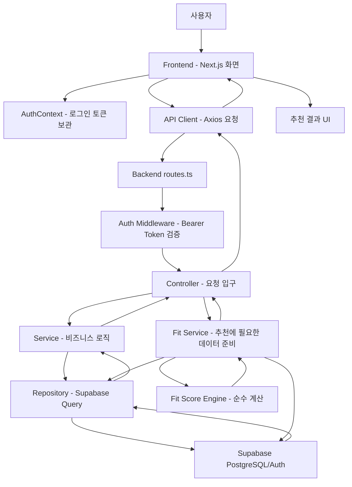
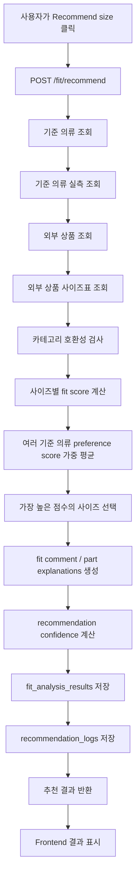

# coordit 초보자용 프로젝트 가이드

이 문서는 coordit 프로젝트를 처음 보는 사람을 위한 설명서입니다.

대상 독자는 “컴퓨터공학 1~2학년 수준으로 웹 개발의 큰 그림은 조금 알지만, 실제 프로젝트 구조는 아직 낯선 사람”입니다.

coordit을 이해할 때 가장 중요한 문장은 이것입니다.

> coordit은 코디 추천 앱이 아니라, 기준 의류(reference clothing) 기반 핏 추천 엔진이다.

즉, coordit은 “오늘 날씨에 어울리는 옷”이나 “데이트룩 추천”을 하는 서비스가 아닙니다.

coordit의 핵심 질문은 하나입니다.

> 내가 이미 잘 맞는다고 느끼는 옷과 비교했을 때, 새로 사려는 상품은 어떤 사이즈가 가장 비슷한 핏일까?

---

## 1. coordit 프로젝트가 무엇인지

### 1.1 coordit이 해결하려는 문제

온라인 쇼핑에서 옷을 살 때 가장 어려운 문제는 “사이즈가 맞을지 모른다”는 것입니다.

예를 들어 어떤 쇼핑몰에서 후드티를 사려고 합니다.

- M은 작을까?
- L은 너무 클까?
- 모델은 180cm인데 나는 173cm라서 다르게 보이지 않을까?
- 평소에는 L을 입지만 이 브랜드는 크게 나오는 편일까?

이런 고민 때문에 사용자는 상품 상세 페이지의 사이즈표를 열어 봅니다.

하지만 사이즈표를 봐도 여전히 어렵습니다.

```text
M: 어깨 54 / 가슴 58 / 총장 68
L: 어깨 56 / 가슴 60 / 총장 70
XL: 어깨 58 / 가슴 63 / 총장 72
```

초보 쇼핑 사용자에게 이 숫자는 바로 감각으로 연결되지 않습니다.

“어깨 56cm가 나한테 적당한가?”라는 질문에 답하기 어렵습니다.

coordit은 이 문제를 이렇게 바꿉니다.

> 숫자를 내 몸과 바로 비교하지 말고, 내가 이미 잘 맞는다고 느끼는 옷과 비교하자.

예를 들어 내가 가진 후드티 중 정말 마음에 드는 핏이 있다고 가정합니다.

```text
내 기준 후드티:
어깨 56
가슴 60
총장 69
소매 62
```

새 상품의 L 사이즈가 아래와 같다면:

```text
새 상품 L:
어깨 57
가슴 61
총장 70
소매 62
```

두 옷은 실측이 매우 비슷합니다.

그러면 coordit은 “L 사이즈가 기준 후드티와 가장 비슷한 핏입니다”라고 추천할 수 있습니다.

### 1.2 왜 기존 온라인 쇼핑이 문제인지

온라인 쇼핑몰은 보통 다음 정보를 제공합니다.

- 모델 키와 몸무게
- 모델 착용 사이즈
- 상품 사이즈표
- 리뷰

하지만 이 정보만으로는 내 핏을 정확히 알기 어렵습니다.

모델 착용 사진은 참고용일 뿐입니다. 같은 키와 몸무게라도 어깨, 가슴, 허리, 팔 길이는 다를 수 있습니다.

리뷰도 애매합니다.

어떤 사람은 “정사이즈”라고 쓰고, 어떤 사람은 “크게 나왔다”고 씁니다.
하지만 그 사람의 기준이 내 기준과 같다는 보장이 없습니다.

사이즈표는 가장 객관적인 정보지만, 숫자만 보고 핏을 상상하기 어렵습니다.

coordit은 이 문제를 “사용자의 기준 의류”로 해결하려고 합니다.

### 1.3 왜 기준 의류 방식이 중요한지

기준 의류란 사용자가 이미 가지고 있고, 핏이 좋다고 느끼는 옷입니다.

쉽게 말하면 “내가 좋아하는 핏의 샘플”입니다.

예를 들어 사용자가 이런 기준 의류를 등록할 수 있습니다.

- 가장 잘 맞는 후드티
- 허리가 편한 청바지
- 어깨가 딱 맞는 셔츠
- 너무 크지도 작지도 않은 맨투맨

이 옷들의 실측 치수가 저장되면, 새 상품을 볼 때 그 옷들과 숫자로 비교할 수 있습니다.

이 방식의 장점은 사용자의 실제 취향이 반영된다는 점입니다.

사람마다 좋아하는 핏은 다릅니다.

- 어떤 사람은 slim fit을 좋아합니다.
- 어떤 사람은 relaxed fit을 좋아합니다.
- 어떤 사람은 oversized fit을 좋아합니다.

단순히 “몸 치수”만 보면 이런 취향을 알기 어렵습니다.

반면 기준 의류는 이미 사용자가 선택한 결과입니다.

즉, 기준 의류는 “몸 치수 + 취향 + 착용감 경험”이 합쳐진 데이터입니다.

### 1.4 왜 단순 신체 치수보다 기준 의류가 더 중요한지

신체 치수는 중요하지만, 옷 핏을 완전히 설명하지 못합니다.

예를 들어 두 사람이 모두 가슴둘레 95cm라고 해도:

- 한 명은 딱 맞는 핏을 좋아할 수 있습니다.
- 한 명은 넉넉한 핏을 좋아할 수 있습니다.

또 옷은 몸에 딱 붙는 물건이 아닙니다.

후드티, 셔츠, 바지에는 여유분이 필요합니다.
이 여유분을 영어로 ease라고 부르기도 합니다.

그래서 단순히 몸 치수와 상품 치수를 비교하면 이런 문제가 생깁니다.

```text
내 가슴둘레: 95cm
상품 가슴단면: 60cm
```

이 숫자만 보고 “잘 맞는다”를 판단하기 어렵습니다.

하지만 기준 의류가 있으면 더 쉬워집니다.

```text
내가 좋아하는 후드티 가슴단면: 60cm
새 상품 L 가슴단면: 61cm
```

이제 판단이 쉬워집니다.

“내가 좋아하는 후드티보다 가슴이 1cm 크다”라고 이해할 수 있습니다.

coordit이 신체 치수보다 기준 의류를 중심에 두는 이유가 여기에 있습니다.

### 1.5 Fit Score Engine 개념

Fit Score Engine은 coordit의 핵심 계산기입니다.

입력은 크게 두 가지입니다.

1. 기준 의류의 실측 치수
2. 외부 상품 사이즈표의 실측 치수

출력은 다음과 같습니다.

- 추천 사이즈
- fit_score
- fit_label
- fit_comment
- 부위별 차이
- 추천 신뢰도

예를 들어:

```text
기준 후드티:
어깨 56 / 가슴 60 / 총장 69 / 소매 62

새 상품:
M: 어깨 54 / 가슴 58 / 총장 68 / 소매 61
L: 어깨 57 / 가슴 61 / 총장 70 / 소매 62
XL: 어깨 60 / 가슴 64 / 총장 73 / 소매 64
```

Fit Score Engine은 M, L, XL을 각각 기준 후드티와 비교합니다.

그리고 가장 비슷한 사이즈를 고릅니다.

```text
M: 82점
L: 92점
XL: 76점

추천: L
```

### 1.6 MVP 목표

MVP는 Minimum Viable Product의 줄임말입니다.

한국어로 풀면 “가장 작은 단위로 실제 테스트 가능한 제품”입니다.

coordit MVP의 목표는 완벽한 AI 쇼핑 서비스를 만드는 것이 아닙니다.

현재 목표는 다음입니다.

1. 사용자가 로그인할 수 있다.
2. 사용자가 보유 의류를 등록할 수 있다.
3. 사용자가 보유 의류의 실측을 입력할 수 있다.
4. 사용자가 그 옷을 기준 의류로 설정할 수 있다.
5. 사용자가 새 외부 상품과 사이즈표를 입력할 수 있다.
6. Fit Score Engine이 사이즈를 추천할 수 있다.
7. 추천 결과와 로그가 DB에 저장된다.
8. 사용자가 화면에서 추천 결과를 확인할 수 있다.

즉, coordit MVP는 “아이디어 설명용 화면”이 아니라, 실제 데이터가 들어가고 실제 계산이 돌아가는 구조를 목표로 합니다.

---

## 2. 전체 프로젝트 구조 설명

현재 프로젝트는 크게 네 개 영역으로 나뉩니다.

```text
coordit-dev/
├── frontend/
├── backend/
├── supabase/
├── docs/
├── README.md
├── .env.example
└── .gitignore
```

### 2.1 frontend

`frontend`는 사용자가 보는 화면입니다.

예를 들어:

- 로그인 화면
- 보유 의류 등록 화면
- 기준 의류 설정 화면
- 외부 상품 등록 화면
- 추천 결과 화면

사용자는 브라우저에서 frontend를 사용합니다.

frontend는 직접 DB에 접속하지 않습니다.

대신 backend API에 요청을 보냅니다.

비유하면 frontend는 식당의 홀 직원입니다.

손님이 주문을 말하면 홀 직원이 주방에 전달합니다.
손님은 주방 내부를 직접 보지 않습니다.

### 2.2 backend

`backend`는 실제 계산과 데이터 처리를 담당합니다.

예를 들어:

- 로그인 토큰 검사
- 사용자가 요청한 데이터가 본인 것인지 확인
- Supabase DB 조회
- Fit Score Engine 실행
- 추천 결과 저장

비유하면 backend는 식당의 주방입니다.

주문을 받아 실제 음식을 만들고, 필요한 재료를 창고에서 꺼내고, 완성된 결과를 홀로 돌려줍니다.

### 2.3 supabase

`supabase`는 데이터베이스 설계 파일이 있는 곳입니다.

Supabase는 PostgreSQL 데이터베이스와 인증 기능을 제공하는 서비스입니다.

이 프로젝트에서는 Supabase가 다음을 담당합니다.

- 사용자 정보 저장
- 보유 의류 저장
- 실측 치수 저장
- 기준 의류 저장
- 외부 상품 저장
- 추천 결과 저장
- 사용자 피드백 저장

### 2.4 docs

`docs`는 문서 폴더입니다.

코드를 바로 읽기 어려운 사람을 위해 다음을 설명합니다.

- DB 구조
- API 구조
- Fit Engine 계산 방식
- frontend/backend 아키텍처
- 개발 로드맵
- 초보자용 프로젝트 가이드

---

## 3. frontend 구조 설명

현재 frontend 구조는 다음과 같습니다.

```text
frontend/
├── package.json
├── package-lock.json
├── tsconfig.json
├── tailwind.config.js
├── postcss.config.js
├── next-env.d.ts
└── src/
    ├── app/
    │   ├── layout.tsx
    │   ├── page.tsx
    │   ├── login/page.tsx
    │   ├── dashboard/page.tsx
    │   ├── wardrobe/page.tsx
    │   ├── wardrobe/sizes/page.tsx
    │   ├── reference/page.tsx
    │   ├── external-products/page.tsx
    │   ├── external-products/sizes/page.tsx
    │   └── fit-result/page.tsx
    ├── components/
    │   ├── Button.tsx
    │   ├── Card.tsx
    │   ├── ClothingItemCard.tsx
    │   ├── ExternalProductCard.tsx
    │   ├── FitScoreResultCard.tsx
    │   ├── FormSection.tsx
    │   ├── Input.tsx
    │   ├── Layout.tsx
    │   ├── MeasurementComparisonTable.tsx
    │   ├── MeasurementInputGroup.tsx
    │   ├── ReferenceClothingCard.tsx
    │   └── SizeScoreTable.tsx
    ├── lib/
    │   ├── api.ts
    │   ├── auth-context.tsx
    │   └── types.ts
    └── styles/
        └── globals.css
```

### 3.1 `frontend/package.json`

frontend 프로젝트의 설정 파일입니다.

여기에는 다음 정보가 들어 있습니다.

- 프로젝트 이름
- 실행 명령어
- 사용하는 라이브러리

예를 들어 `npm run dev`는 Next.js 개발 서버를 실행합니다.

### 3.2 `frontend/src/app`

`src/app`은 Next.js App Router의 페이지 폴더입니다.

Next.js에서는 폴더 이름이 URL 경로가 됩니다.

예를 들어:

```text
src/app/login/page.tsx
```

이 파일은 브라우저에서 다음 주소로 접근됩니다.

```text
/login
```

즉, `page.tsx`는 실제 화면 하나를 의미합니다.

### 3.3 `src/app/layout.tsx`

전체 페이지를 감싸는 공통 틀입니다.

현재 이 파일은 `AuthProvider`로 전체 앱을 감쌉니다.

왜 필요할까요?

로그인 토큰은 여러 페이지에서 필요합니다.

- `/wardrobe`에서 보유 의류 저장
- `/reference`에서 기준 의류 저장
- `/external-products`에서 상품 저장
- `/fit-result`에서 추천 실행

모든 페이지마다 로그인 상태 관리 코드를 반복하면 복잡해집니다.

그래서 `layout.tsx`에서 앱 전체에 로그인 상태를 공유합니다.

### 3.4 `src/app/login/page.tsx`

로그인과 회원가입 화면입니다.

사용자가 이메일과 비밀번호를 입력하고 버튼을 누르면 다음 일이 일어납니다.

```text
사용자 입력
↓
login/page.tsx의 submit 함수 실행
↓
auth-context.tsx의 login 또는 signup 호출
↓
api.ts가 backend /auth/login 또는 /auth/signup 호출
↓
backend가 Supabase Auth 처리
↓
accessToken 반환
↓
frontend가 localStorage에 토큰 저장
```

초보자가 헷갈릴 수 있는 부분은 “로그인 정보가 어디에 저장되는가”입니다.

현재 frontend는 access token을 브라우저의 `localStorage`에 저장합니다.

이 토큰은 이후 API 요청마다 `Authorization: Bearer <token>` 형태로 들어갑니다.

### 3.5 `src/app/wardrobe/page.tsx`

보유 의류 등록 화면입니다.

이 화면에서 사용자는 자신이 이미 가지고 있는 옷을 등록합니다.

예:

```text
이름: 가장 잘 맞는 회색 후드티
브랜드: Uniqlo
카테고리: hoodie
핏 타입: relaxed
사이즈: L
어깨: 56
가슴단면: 60
총장: 69
소매: 62
```

버튼을 누르면 두 번의 API 호출이 일어납니다.

1. `/clothing-items`로 의류 기본 정보 저장
2. `/clothing-items/:id/sizes`로 실측 치수 저장

왜 나눠져 있을까요?

의류 자체와 사이즈 실측은 성격이 다르기 때문입니다.

의류 기본 정보:

- 이름
- 브랜드
- 카테고리
- 이미지

실측 정보:

- 총장
- 어깨
- 가슴단면
- 소매
- 허리
- 인심

한 옷에 여러 사이즈 정보를 저장할 수도 있으므로 별도 테이블로 분리되어 있습니다.

### 3.6 `src/app/reference/page.tsx`

기준 의류 설정 화면입니다.

보유 의류를 등록했다고 해서 전부 추천 기준으로 쓰는 것은 아닙니다.

사용자가 “이 옷은 핏 기준으로 삼고 싶다”고 선택해야 합니다.

이때 기준 의류가 됩니다.

현재 화면에서는 다음을 설정합니다.

- 어떤 보유 의류를 기준으로 쓸지
- 별명
- 카테고리
- 핏 타입
- preference score

`preference score`는 이 기준 의류를 얼마나 중요하게 볼지 나타내는 점수입니다.

예:

```text
기준 후드티 A: preference_score 100
기준 후드티 B: preference_score 80
```

A가 B보다 더 마음에 드는 핏이라면 A의 영향력이 더 큽니다.

### 3.7 `src/app/external-products/page.tsx`

외부 상품 등록 화면입니다.

외부 상품이란 사용자가 새로 구매하려는 온라인 쇼핑몰 상품입니다.

예:

```text
상품명: 오버핏 후드티
브랜드: 무신사 스탠다드
쇼핑몰: Musinsa
URL: https://...
카테고리: hoodie
핏 타입: relaxed
```

이 화면은 외부 상품 정보와 사이즈표를 저장합니다.

현재는 사용자가 사이즈표를 직접 입력하는 방식입니다.

OCR이나 URL 자동 크롤링은 아직 실제 구현이 아니라 mock 구조만 준비되어 있습니다.

### 3.8 `src/app/fit-result/page.tsx`

추천 실행 화면입니다.

사용자는 여기에서:

1. 기준 의류를 여러 개 선택합니다.
2. 외부 상품을 선택합니다.
3. `Recommend size` 버튼을 누릅니다.

그러면 frontend가 backend의 `/fit/recommend` API를 호출합니다.

응답을 받으면 화면에 다음을 표시합니다.

- 추천 사이즈
- fit score
- fit label
- 추천 신뢰도
- 부위별 설명
- 사이즈별 점수표
- 부위별 차이표

### 3.9 `src/components`

components 폴더는 재사용 가능한 UI 조각을 모아둔 곳입니다.

예를 들어 버튼은 여러 화면에서 필요합니다.

매번 `<button>` 스타일을 새로 쓰면 코드가 반복됩니다.

그래서 `Button.tsx`를 만들어 재사용합니다.

각 파일 역할은 다음과 같습니다.

- `Button.tsx`: 버튼 UI
- `Input.tsx`: 라벨이 붙은 입력창
- `Card.tsx`: 테두리와 여백이 있는 카드
- `FormSection.tsx`: 폼 영역 묶음
- `Layout.tsx`: 페이지 공통 레이아웃
- `ClothingItemCard.tsx`: 보유 의류 표시 카드
- `ExternalProductCard.tsx`: 외부 상품 표시 카드
- `ReferenceClothingCard.tsx`: 기준 의류 표시 카드
- `FitScoreResultCard.tsx`: 추천 결과 핵심 카드
- `SizeScoreTable.tsx`: 사이즈별 점수표
- `MeasurementComparisonTable.tsx`: 부위별 차이표
- `MeasurementInputGroup.tsx`: 실측 입력 묶음용 컴포넌트

### 3.10 `src/lib`

`lib`는 화면은 아니지만 여러 곳에서 쓰이는 도구 코드를 모아둔 폴더입니다.

#### `api.ts`

backend API를 호출하는 공통 함수가 있습니다.

현재는 axios를 사용합니다.

역할은 다음입니다.

- API 기본 주소 설정
- JSON 요청 설정
- 로그인 토큰을 Authorization 헤더에 넣기
- GET/POST/PATCH 요청 보내기

#### `auth-context.tsx`

로그인 상태를 관리합니다.

여기서 하는 일:

- access token 저장
- 로그인한 이메일 저장
- login 함수 제공
- signup 함수 제공
- logout 함수 제공
- token을 api client에 연결

#### `types.ts`

frontend에서 사용하는 TypeScript 타입 정의입니다.

예를 들어 `FitRecommendationResponse` 타입은 추천 API 응답이 어떤 모양인지 알려줍니다.

타입이 있으면 개발자가 실수로 잘못된 필드를 쓰는 일을 줄일 수 있습니다.

---

## 4. backend 구조 설명

현재 backend 구조는 다음과 같습니다.

```text
backend/
├── package.json
├── tsconfig.json
└── src/
    ├── server.ts
    ├── app.ts
    ├── routes.ts
    ├── config/
    │   ├── env.ts
    │   └── supabase.ts
    ├── middleware/
    │   ├── auth.middleware.ts
    │   └── error.middleware.ts
    ├── modules/
    │   ├── auth/
    │   ├── users/
    │   ├── body-measurements/
    │   ├── clothing-items/
    │   ├── clothing-sizes/
    │   ├── reference-clothing/
    │   ├── external-products/
    │   ├── external-product-sizes/
    │   ├── fit/
    │   ├── feedback/
    │   └── recommendation-logs/
    └── shared/
        ├── types/
        └── utils/
```

### 4.1 backend 전체 흐름

backend는 사용자의 요청을 다음 순서로 처리합니다.

```text
HTTP 요청
↓
routes.ts
↓
auth.middleware.ts
↓
controller
↓
service
↓
repository
↓
Supabase DB
↓
service
↓
controller
↓
HTTP 응답
```

초보자용 비유:

- routes: 건물 안내 표지판
- middleware: 입구 보안 검사
- controller: 접수 창구
- service: 실제 업무 담당자
- repository: 자료실 담당자
- Supabase: 자료가 보관된 창고

### 4.2 `server.ts`

서버를 실제로 실행하는 파일입니다.

Express 앱을 가져와서 지정된 포트에서 실행합니다.

사용자가 `npm run dev`를 실행하면 결국 이 파일이 서버를 켭니다.

### 4.3 `app.ts`

Express 앱의 기본 설정을 담당합니다.

여기에는 다음 설정이 있습니다.

- CORS 설정
- JSON 요청 body 파싱
- health check
- routes 연결
- error middleware 연결

`/health` API는 서버가 살아 있는지 확인하는 간단한 주소입니다.

### 4.4 `routes.ts`

모든 API 주소를 모아두는 파일입니다.

예를 들어:

```text
POST /auth/signup
POST /auth/login
GET /clothing-items
POST /fit/recommend
```

이 파일은 “어떤 주소가 어떤 controller 함수로 연결되는지”를 알려줍니다.

초보자가 API를 찾고 싶다면 `routes.ts`를 먼저 보면 됩니다.

### 4.5 `config/env.ts`

환경변수를 읽는 파일입니다.

환경변수는 코드에 직접 쓰면 위험하거나 바뀔 수 있는 값입니다.

예:

- Supabase URL
- Supabase anon key
- Supabase service role key
- 서버 포트

왜 코드에 바로 쓰지 않을까요?

Supabase key 같은 값은 비밀번호처럼 다뤄야 합니다.
GitHub에 올라가면 안 됩니다.

그래서 `.env`에 저장하고, `env.ts`가 읽어옵니다.

### 4.6 `config/supabase.ts`

Supabase client를 만드는 파일입니다.

backend가 DB에 접근하려면 Supabase와 연결된 client가 필요합니다.

이 파일은 그 연결 도구를 만들어 다른 파일에서 사용할 수 있게 export합니다.

### 4.7 `middleware/auth.middleware.ts`

인증 검사 담당입니다.

로그인한 사용자만 접근해야 하는 API가 많습니다.

예:

- 내 보유 의류 조회
- 내 기준 의류 등록
- 내 추천 결과 조회

사용자는 요청할 때 이런 헤더를 보냅니다.

```text
Authorization: Bearer access_token
```

`auth.middleware.ts`는 이 토큰을 Supabase Auth에 확인합니다.

정상 토큰이면:

```text
req.user = { id, email }
```

처럼 요청 객체에 사용자 정보를 넣습니다.

그 뒤 controller와 service는 `req.user.id`를 이용해 “이 사용자의 데이터만” 조회합니다.

### 4.8 `middleware/error.middleware.ts`

에러 응답을 통일하는 파일입니다.

코드 중간에서 에러가 발생하면, 사용자에게 이상한 내부 오류 메시지를 그대로 보여주면 안 됩니다.

이 middleware는 에러를 받아서 다음 형태로 응답합니다.

```json
{
  "message": "에러 메시지"
}
```

### 4.9 modules 폴더

`modules`는 기능별 묶음입니다.

현재 주요 모듈은 다음과 같습니다.

- `auth`: 회원가입, 로그인
- `users`: 사용자 프로필
- `body-measurements`: 신체 치수
- `clothing-items`: 보유 의류
- `clothing-sizes`: 보유 의류 실측
- `reference-clothing`: 기준 의류
- `external-products`: 외부 상품
- `external-product-sizes`: 외부 상품 사이즈표
- `fit`: 핏 추천 계산
- `feedback`: 사용자 피드백
- `recommendation-logs`: 추천 로그

### 4.10 controller란 무엇인가

controller는 API 요청의 입구입니다.

예를 들어 사용자가 `/clothing-items`로 POST 요청을 보냈다고 합시다.

controller는 다음 일을 합니다.

1. 로그인한 사용자 확인
2. 요청 body 읽기
3. service 호출
4. 결과를 JSON으로 응답

controller는 DB를 직접 만지지 않습니다.

왜냐하면 controller가 너무 많은 일을 하면 코드가 복잡해지기 때문입니다.

### 4.11 service란 무엇인가

service는 실제 업무 규칙을 처리합니다.

예를 들어 보유 의류를 저장할 때:

- name은 필수인가?
- category는 어떤 값인가?
- fitType이 없으면 regular로 볼 것인가?
- 요청 body를 DB 컬럼 이름으로 바꿀 것인가?

이런 판단은 service에서 합니다.

service는 비즈니스 로직 담당입니다.

### 4.12 repository란 무엇인가

repository는 DB 접근 전용 파일입니다.

예를 들어 `clothing-items.repository.ts`는 Supabase의 `clothing_items` 테이블에 접근합니다.

repository가 하는 일:

- insert
- select
- update
- delete

repository는 “핏 점수 계산” 같은 업무 규칙을 알 필요가 없습니다.

그저 DB에 데이터를 넣고 꺼내는 역할입니다.

### 4.13 왜 controller/service/repository를 나누는가

작은 프로젝트에서는 한 파일에 다 넣어도 동작은 합니다.

하지만 기능이 늘어나면 문제가 생깁니다.

예를 들어 한 파일에 다음이 모두 있으면:

- 요청 검사
- DB 조회
- 계산 로직
- 에러 처리
- 응답 만들기

나중에 수정하기 어렵습니다.

그래서 역할을 나눕니다.

```text
controller: 요청과 응답
service: 업무 규칙
repository: DB 접근
```

이 구조는 초보자에게 처음에는 파일이 많아 보여 어렵지만, 시간이 지나면 훨씬 찾기 쉬운 구조입니다.

---

## 5. Fit Score Engine 구조 설명

Fit Score Engine은 coordit의 심장입니다.

파일 위치:

```text
backend/src/modules/fit/
├── fit.controller.ts
├── fit.service.ts
├── fit-score.engine.ts
├── fit.constants.ts
└── fit.types.ts
```

### 5.1 기준 의류란 무엇인가

기준 의류는 사용자가 이미 가지고 있고, 핏이 좋다고 느끼는 옷입니다.

예:

```text
내가 가장 좋아하는 회색 후드티
내 허리에 잘 맞는 청바지
어깨가 딱 맞는 셔츠
```

coordit은 이 기준 의류를 “정답에 가까운 샘플”로 사용합니다.

### 5.2 실측 치수란 무엇인가

실측 치수는 옷 자체를 줄자로 잰 값입니다.

상의 예:

- 총장
- 어깨
- 가슴단면
- 소매

하의 예:

- 허리단면
- 엉덩이단면
- 밑위
- 인심

이 프로젝트에서는 영어 컬럼명을 사용합니다.

```text
total_length    총장
shoulder_width  어깨
chest_width     가슴단면
sleeve_length   소매
waist_width     허리단면
hip_width       엉덩이단면
rise            밑위
inseam          인심
```

### 5.3 weighted_fit_distance란 무엇인가

`weighted_fit_distance`는 “기준 의류와 외부 상품 사이즈가 얼마나 다른지”를 나타내는 숫자입니다.

작을수록 더 비슷합니다.

단순히 모든 부위 차이를 똑같이 더하지 않습니다.

왜냐하면 부위마다 핏에 주는 영향이 다르기 때문입니다.

후드티에서 어깨와 가슴은 매우 중요합니다.
소매도 중요하지만, 어깨나 가슴보다 덜 중요할 수 있습니다.

그래서 가중치를 둡니다.

현재 상의 가중치:

```text
어깨: 0.35
가슴단면: 0.30
총장: 0.20
소매: 0.15
```

현재 하의 가중치:

```text
허리단면: 0.35
엉덩이단면: 0.25
밑위: 0.15
인심: 0.25
```

### 5.4 fit_score는 어떻게 계산되는가

현재 기본 공식은 단순합니다.

```text
fit_score = 100 - weighted_fit_distance * 10
```

예:

```text
weighted_fit_distance = 1.2
fit_score = 100 - 1.2 * 10 = 88
```

점수는 0점보다 작아지지 않고, 100점을 넘지 않도록 제한됩니다.

### 5.5 계산 예시: 후드티

기준 후드티:

```text
어깨 56
가슴 60
총장 69
소매 62
```

외부 상품 L:

```text
어깨 57
가슴 61
총장 70
소매 62
```

먼저 차이를 계산합니다.

```text
어깨 diff = 57 - 56 = +1
가슴 diff = 61 - 60 = +1
총장 diff = 70 - 69 = +1
소매 diff = 62 - 62 = 0
```

그 다음 각 차이에 가중치를 곱합니다.

```text
어깨: |1| * 0.35 = 0.35
가슴: |1| * 0.30 = 0.30
총장: |1| * 0.20 = 0.20
소매: |0| * 0.15 = 0.00
```

합치면:

```text
0.35 + 0.30 + 0.20 + 0.00 = 0.85
```

가중치 합은:

```text
0.35 + 0.30 + 0.20 + 0.15 = 1.00
```

따라서:

```text
weighted_fit_distance = 0.85 / 1.00 = 0.85
fit_score = 100 - 0.85 * 10 = 91.5
```

즉 L 사이즈는 기준 후드티와 매우 비슷합니다.

### 5.6 여러 기준 의류를 쓰는 이유

사람은 옷 하나만 기준으로 취향을 설명하기 어렵습니다.

예를 들어 사용자가 잘 맞는 후드티를 두 개 가지고 있을 수 있습니다.

```text
기준 후드티 A: 정말 마음에 듦, preference_score 100
기준 후드티 B: 꽤 괜찮음, preference_score 80
```

외부 상품 L에 대해 각각 점수를 계산합니다.

```text
A 기준 점수: 92
B 기준 점수: 86
```

최종 점수는 preference_score로 가중 평균합니다.

```text
final_score = (92 * 100 + 86 * 80) / (100 + 80)
            = (9200 + 6880) / 180
            = 89.33
```

이렇게 하면 더 좋아하는 기준 의류가 결과에 더 큰 영향을 줍니다.

### 5.7 fit_label은 무엇인가

`fit_label`은 점수를 사람이 이해하기 쉽게 바꾼 라벨입니다.

현재 기준:

```text
95점 이상: very_good_fit
85점 이상: good_fit
70점 이상: acceptable
50점 이상: slightly_small 또는 slightly_large
50점 미만: too_small 또는 too_large
```

점수가 낮을 때 small인지 large인지는 평균 diff 방향을 봅니다.

외부 상품이 기준 의류보다 대체로 작으면 small 계열,
대체로 크면 large 계열입니다.

### 5.8 fit_type penalty는 무엇인가

fit_type은 사용자가 원하는 핏 방향입니다.

예:

- slim
- regular
- relaxed
- oversized

예를 들어 oversized 핏을 기대하는데, 외부 상품이 기준 의류보다 어깨나 가슴이 많이 작다면 문제가 됩니다.

그래서 penalty가 적용됩니다.

점수 계산 후 상황에 따라 몇 점을 깎습니다.

이것은 단순 치수 차이만 보는 것이 아니라, “의도한 핏”을 반영하기 위한 장치입니다.

### 5.9 recommendation confidence란 무엇인가

recommendation confidence는 추천 신뢰도입니다.

값은 세 가지입니다.

```text
high
medium
low
```

현재 신뢰도는 다음을 보고 판단합니다.

1. 비교에 사용된 치수 개수
2. fit_score 수준
3. weighted_fit_distance 크기
4. 1등 사이즈와 다음 사이즈의 점수 차이

예를 들어:

- 어깨, 가슴, 총장, 소매 모두 비교 가능
- 추천 점수가 90점 이상
- weighted distance가 작음
- 2등 사이즈보다 점수 차이가 큼

이러면 high가 될 수 있습니다.

반대로 실측 데이터가 부족하면 아무리 점수가 높아도 신뢰도가 낮을 수 있습니다.

### 5.10 category compatibility

모든 카테고리를 서로 비교하면 안 됩니다.

후드티와 맨투맨은 어느 정도 비교 가능합니다.

하지만 티셔츠와 청바지를 비교하는 것은 의미가 없습니다.

현재 compatibility 예:

```text
hoodie ↔ sweatshirt 가능
pants ↔ jeans 가능
shirt ↔ tshirt ↔ knit 가능
jacket ↔ coat 가능
```

이 검사는 다음 파일에 있습니다.

```text
backend/src/shared/utils/category-compatibility.ts
```

---

## 6. 실제 데이터 흐름 설명

예시 상황:

> 사용자가 새 후드티를 추천받고 싶다.

### 6.1 1단계: 로그인

사용자가 `/login` 화면에서 로그인합니다.

```text
브라우저
↓
POST /auth/login
↓
backend auth controller
↓
Supabase Auth
↓
accessToken 반환
↓
frontend localStorage 저장
```

이제 이후 요청에는 accessToken이 붙습니다.

### 6.2 2단계: 보유 의류 등록

사용자가 `/wardrobe`에서 기존 후드티를 등록합니다.

frontend는 먼저 의류 정보를 저장합니다.

```text
POST /clothing-items
```

DB의 `clothing_items` 테이블에 저장됩니다.

그 다음 실측을 저장합니다.

```text
POST /clothing-items/:id/sizes
```

DB의 `clothing_sizes` 테이블에 저장됩니다.

### 6.3 3단계: 기준 의류 설정

사용자가 `/reference`에서 이 후드티를 기준 의류로 설정합니다.

```text
POST /reference-clothing
```

DB의 `reference_clothing` 테이블에 저장됩니다.

이때 preference_score도 저장됩니다.

### 6.4 4단계: 외부 상품 등록

사용자가 `/external-products`에서 새로 살 후드티를 등록합니다.

```text
POST /external-products
```

DB의 `external_products`에 저장됩니다.

사이즈표는:

```text
POST /external-products/:id/sizes
```

DB의 `external_product_sizes`에 저장됩니다.

### 6.5 5단계: 추천 실행

사용자가 `/fit-result`에서 기준 의류와 외부 상품을 선택하고 버튼을 누릅니다.

frontend 요청:

```json
{
  "referenceClothingIds": ["기준의류ID"],
  "externalProductId": "외부상품ID"
}
```

backend API:

```text
POST /fit/recommend
```

### 6.6 6단계: backend 처리

backend는 다음 순서로 처리합니다.

1. 토큰 검사
2. 기준 의류 조회
3. 기준 의류의 보유 의류 조회
4. 기준 의류의 실측 조회
5. 외부 상품 조회
6. 외부 상품 사이즈표 조회
7. 카테고리 호환성 검사
8. Fit Score Engine 실행
9. 추천 결과 저장
10. 추천 로그 저장
11. 응답 반환

### 6.7 7단계: 결과 표시

frontend는 응답을 받아 다음 UI를 보여줍니다.

- 추천 카드
- 점수 progress bar
- 사이즈별 점수표
- 부위별 차이표
- 부위별 설명

---

## 7. 현재까지 구현된 기능

현재 구현된 기능은 다음과 같습니다.

```text
✅ monorepo 스타일 폴더 구조
✅ frontend / backend / supabase / docs 분리
✅ Supabase schema.sql
✅ indexes.sql
✅ rls.sql 초안
✅ Express + TypeScript backend
✅ Next.js + TypeScript + Tailwind frontend
✅ Supabase client 연결 코드
✅ 환경변수 validation
✅ Supabase Auth 회원가입 / 로그인 API
✅ Bearer token 인증 middleware
✅ users 프로필 조회 / 수정
✅ body_measurements 생성 / 조회
✅ clothing_items CRUD
✅ clothing_sizes CRUD
✅ reference_clothing CRUD
✅ reference_clothing by category 조회
✅ external_products CRUD
✅ external_product_sizes CRUD
✅ external-products/from-url mock parsing
✅ Fit Score Engine MVP
✅ 여러 기준 의류 가중 평균 계산
✅ category compatibility 검사
✅ fit explanation 강화
✅ recommendation confidence 계산
✅ fit/recommend API
✅ fit/recommend/batch API
✅ fit_analysis_results 저장 / 조회
✅ recommendation_logs 저장 / 조회 / click / purchase 표시
✅ user_feedback 저장 / 조회
✅ frontend auth context
✅ frontend API client
✅ 로그인 화면 실제 API 연결
✅ 보유 의류 등록 화면 실제 API 연결
✅ 기준 의류 설정 화면 실제 API 연결
✅ 외부 상품 등록 화면 실제 API 연결
✅ Fit 추천 실행 화면 실제 API 연결
✅ 추천 결과 UI 카드 / 테이블 / 점수바
✅ OCR/URL 확장용 size-parser 구조
✅ architecture docs
```

현재 수준에서 가능한 것은 다음입니다.

1. 개발 환경에서 frontend 화면을 실행할 수 있습니다.
2. Supabase 환경변수가 준비되면 backend API를 실행할 수 있습니다.
3. 사용자는 로그인 후 보유 의류와 실측을 등록할 수 있습니다.
4. 기준 의류를 설정할 수 있습니다.
5. 외부 상품과 사이즈표를 등록할 수 있습니다.
6. Fit 추천을 실행할 수 있습니다.
7. 추천 결과와 로그를 DB에 저장할 수 있습니다.

단, 실제 운영 서비스라고 부르기에는 아직 부족합니다.

---

## 8. 아직 구현되지 않은 기능

아직 구현되지 않았거나 초안 수준인 기능은 다음과 같습니다.

```text
❌ 실제 OCR 이미지 인식
❌ 실제 URL 크롤링
❌ 쇼핑몰별 HTML 파싱
❌ 브랜드별 사이즈 보정 모델
❌ 사용자 피드백 기반 추천 정확도 자동 개선
❌ ML 기반 개인화 추천
❌ 관리자 페이지
❌ 이미지 업로드 저장소 연결
❌ 실제 배포 환경 설정
❌ Supabase migration 파일 분리
❌ production 수준 보안 점검
❌ E2E 테스트
❌ 단위 테스트
```

왜 아직 구현하지 않았을까요?

이 프로젝트의 현재 목표는 “핵심 흐름이 실제로 되는 MVP”입니다.

OCR이나 ML은 멋있지만, 핵심 흐름이 안정적이지 않으면 의미가 없습니다.

먼저 다음이 안정적이어야 합니다.

- 사용자 데이터 저장
- 기준 의류 저장
- 외부 상품 사이즈표 저장
- fit score 계산
- 결과 저장
- 사용자에게 결과 표시

그 다음 OCR, URL 파싱, ML을 붙이는 것이 안전합니다.

---

## 9. 앞으로 개발해야 할 순서

### 9.1 1단계: Supabase 실제 환경 정리

가장 먼저 해야 할 일은 실제 Supabase 프로젝트와 schema를 맞추는 것입니다.

해야 할 일:

- `.env` 생성
- Supabase URL/key 설정
- schema.sql 적용
- 기존 DB가 있다면 migration 작성
- RLS 정책 검증

왜 먼저 해야 할까요?

모든 기능은 결국 DB에 저장되어야 합니다.

DB가 불안정하면 frontend와 backend가 아무리 좋아도 실제 테스트가 어렵습니다.

### 9.2 2단계: 회원가입 / 로그인 안정화

해야 할 일:

- 이메일 인증 여부 결정
- 비밀번호 정책 정리
- 로그인 실패 메시지 개선
- 토큰 만료 처리
- refresh token 처리

왜 중요할까요?

coordit 데이터는 사용자별로 분리되어야 합니다.

다른 사람의 옷 데이터가 보이면 안 됩니다.

### 9.3 3단계: 보유 의류 등록 UX 개선

해야 할 일:

- 카테고리 select box
- fit type select box
- 실측 입력 validation
- 단위 표시
- 입력 예시
- 수정/삭제 UI

왜 중요할까요?

Fit Engine의 정확도는 입력 데이터 품질에 달려 있습니다.

사용자가 실측을 잘못 입력하면 추천도 틀립니다.

### 9.4 4단계: Fit Engine 테스트 추가

해야 할 일:

- 단일 기준 의류 계산 테스트
- 여러 기준 의류 가중 평균 테스트
- 상의/하의 가중치 테스트
- category compatibility 테스트
- confidence 계산 테스트

왜 중요할까요?

Fit Engine은 coordit의 핵심입니다.

이 부분은 UI보다 더 신중하게 검증해야 합니다.

### 9.5 5단계: 사용자 피드백 루프 만들기

해야 할 일:

- 추천 결과에 대한 실제 착용 피드백 입력
- 구매 사이즈 기록
- 실제 핏 rating 저장
- 추천이 맞았는지 분석

왜 중요할까요?

추천 서비스는 사용자의 실제 반응을 통해 좋아집니다.

### 9.6 6단계: OCR / URL 파싱 연결

해야 할 일:

- 상품 URL에서 HTML 가져오기
- 사이즈표 후보 추출
- OCR 이미지 텍스트 추출
- measurement mapper 개선
- parsing confidence 저장

왜 나중에 해야 할까요?

OCR과 크롤링은 예외가 많습니다.

쇼핑몰마다 HTML 구조가 다르고, 이미지 품질도 다릅니다.

그래서 핵심 추천 흐름이 먼저 안정되어야 합니다.

### 9.7 7단계: 실제 사용자 테스트

해야 할 일:

- 5~10명의 사용자에게 기준 의류 등록 요청
- 실제 구매 예정 상품으로 추천 테스트
- 추천 결과가 체감상 맞는지 확인
- 틀린 사례 수집

이 단계에서 중요한 것은 “정확도 느낌”입니다.

숫자상 90점이어도 사용자가 “별로 안 맞았다”고 느끼면 개선해야 합니다.

---

## 10. 초보자가 가장 헷갈릴 부분 정리

### 10.1 frontend와 backend 차이

frontend는 사용자가 보는 화면입니다.

backend는 화면 뒤에서 데이터를 처리하는 서버입니다.

예:

```text
frontend: 로그인 버튼, 입력창, 추천 결과 카드
backend: 로그인 검증, DB 저장, fit score 계산
```

### 10.2 API가 무엇인가

API는 frontend와 backend가 대화하는 약속입니다.

예를 들어 frontend가 backend에게 이렇게 말합니다.

```text
이 보유 의류를 저장해줘.
```

이 요청이 실제 코드에서는:

```text
POST /clothing-items
```

가 됩니다.

### 10.3 DB가 왜 필요한가

DB는 데이터를 오래 저장하기 위해 필요합니다.

브라우저 화면에만 데이터를 저장하면 새로고침하거나 다른 기기에서 접속할 때 사라질 수 있습니다.

coordit은 다음 데이터를 계속 보관해야 합니다.

- 사용자 계정
- 보유 의류
- 기준 의류
- 외부 상품
- 추천 결과
- 피드백

그래서 DB가 필요합니다.

### 10.4 Supabase 역할

Supabase는 이 프로젝트에서 두 가지 큰 역할을 합니다.

1. 로그인/회원가입 처리
2. PostgreSQL DB 제공

backend는 Supabase client를 이용해 Supabase와 통신합니다.

### 10.5 fit engine은 어디서 실행되는가

Fit Engine은 backend에서 실행됩니다.

파일 위치:

```text
backend/src/modules/fit/fit-score.engine.ts
```

frontend에서 계산하지 않는 이유는 다음과 같습니다.

- 계산 로직을 한 곳에서 관리하기 위해
- 사용자가 계산 로직을 조작하기 어렵게 하기 위해
- 추천 결과를 DB에 안정적으로 저장하기 위해
- 나중에 ML이나 더 복잡한 로직을 붙이기 쉽게 하기 위해

### 10.6 왜 backend에서 DB를 조회하는가

frontend가 직접 DB를 조회할 수도 있지만, 현재 구조에서는 backend를 거칩니다.

이유:

- 인증 검사
- 사용자별 데이터 제한
- 비즈니스 로직 처리
- 에러 응답 통일
- Fit Engine 실행

### 10.7 기준 의류와 보유 의류 차이

보유 의류는 사용자가 가진 모든 옷입니다.

기준 의류는 그중에서 추천 기준으로 쓰기로 선택한 옷입니다.

즉:

```text
보유 의류 ⊃ 기준 의류
```

모든 기준 의류는 보유 의류이지만, 모든 보유 의류가 기준 의류는 아닙니다.

### 10.8 external product와 external product size 차이

external product는 상품 자체입니다.

예:

```text
무신사 스탠다드 오버핏 후드티
```

external product size는 그 상품의 사이즈별 실측입니다.

예:

```text
M: 어깨 54 / 가슴 58
L: 어깨 56 / 가슴 60
XL: 어깨 58 / 가슴 63
```

상품 하나에 여러 사이즈가 있으므로 테이블을 나눕니다.

---

## 11. 현재 프로젝트 상태 요약

현재 coordit은 “아이디어 단계”는 지났습니다.

또 단순히 화면만 있는 “프로토타입”도 아닙니다.

현재 상태는 다음에 가깝습니다.

> 실제 동작 MVP로 넘어가는 중간 단계

이미 갖춰진 것:

- 프로젝트 구조
- DB schema
- backend API 구조
- Supabase Auth 연결
- CRUD API
- Fit Engine v1.1
- frontend API 연결
- 추천 결과 UI
- 문서 구조

아직 부족한 것:

- 실제 Supabase 환경에서 end-to-end 검증
- migration 정리
- 테스트 코드
- OCR/URL 실제 구현
- production 보안/배포 준비
- 사용자 테스트

현실적으로 말하면:

```text
개발자 테스트 가능한 MVP에 가까워지고 있음
하지만 일반 사용자에게 바로 공개하기에는 아직 이른 상태
```

---

## 12. 최종 아키텍처 흐름도



### Fit 추천 내부 흐름도



---

## 마지막으로 기억할 것

coordit의 핵심은 “무슨 옷을 입을지 추천”이 아닙니다.

coordit의 핵심은 “내가 이미 좋아하는 핏과 가장 비슷한 사이즈를 찾는 것”입니다.

그래서 앞으로 기능을 추가할 때도 항상 이 질문으로 돌아와야 합니다.

> 이 기능이 기준 의류 기반 핏 추천을 더 정확하게 만드는가?

이 질문에 답할 수 있으면 coordit의 방향과 맞습니다.

답하기 어렵다면, 코디 추천이나 스타일 추천 쪽으로 새고 있을 가능성이 높습니다.
